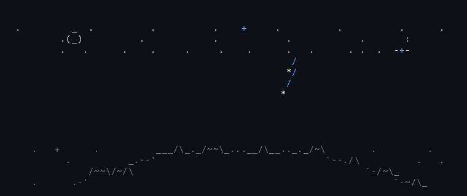

# Mathew Ospino Hernandez
### **Full-Stack Software Engineer · Data & Distributed Systems**
*Mechatronics Engineer · Computer & Systems Engineer*  
*M.Sc. Student in Mechatronics & Space Systems @ Politecnico di Torino*

---

## 🧭 About Me

Engineer with dual degrees in **Mechatronics Engineering** and **Computer & Systems Engineering**, currently pursuing an **M.Sc. in Mechatronic Systems with focus on Space Systems** at **Politecnico di Torino** (Italy). 

My primary professional track is in **Full-Stack Software Development**, **Data Layers & Analytics**, and **Technical Project Management**. I bridge physical mechatronic principles with modern cloud, data, and web infrastructures—from reactive enterprise web applications and data modeling to autonomous robotic platforms.

- 💻 **Core Expertise:** Web architectures, RESTful APIs, data modeling & persistent data layers (PostgreSQL, Supabase, Redis), and frontend ecosystems (React, Next.js, TypeScript).
- 🤖 **Mechatronics & Robotics:** Autonomous navigation, microcontrollers, sensing, ROS/ROS 2, embedded systems, and simulation (Gazebo, MATLAB/Simulink).
- 📍 **Location:** Turin, Italy 🇮🇹 / Remote worldwide 🌍
- 📬 **Get in touch:** [mathewospino48@gmail.com](mailto:mathewospino48@gmail.com)

---

## 🚀 Featured Projects

<table>
  <tr>
    <td width="50%" valign="top">
      <h3 align="center">🌱 AmbientaList Platform</h3>
      

        
        
        
        
      

      
Full-stack environmental compliance and ESG audit management platform. Features an async FastAPI REST API, structured data models with Supabase/PostgreSQL, vector embeddings, and an interactive Next.js analytics dashboard.

      
<b><a href="https://github.com/MathenoMMG/AmbientaList">View Repository →</a></b>

    </td>
    <td width="50%" valign="top">
      <h3 align="center">🤖 Ratatoskr: Campus Delivery Robot</h3>
      

        
        
        
        
      

      
Autonomous internal messenger and delivery rover designed for university campuses. Undergraduate capstone engineering project featuring autonomous navigation, package routing, payload sensing, and mobile coordination interface.

      
<b><a href="https://github.com/F1ammetta/ratatoskr">View Repository →</a></b>

    </td>
  </tr>
  <tr>
    <td width="50%" valign="top">
      <h3 align="center">🇮🇹 Parleró: PoliTo Italian CLA A2 Prep</h3>
      

        
        
        
        
      

      
Interactive study and exam simulation platform created for international students at <strong>Politecnico di Torino</strong> to prepare for the official <strong>CLA A2 Italian exam</strong>. Features a 10-milestone study path, timed exam simulation engine, offline-first sync with Supabase, and full dark/light editorial design.

      
<b><a href="https://github.com/MathenoMMG/Parlero">View Repository →</a></b>

    </td>
    <td width="50%" valign="top">
      <h3 align="center">🚁 Multi-Agent UAV Simulation (ROBOTICS)</h3>
      

        
        
        
        
      

      
Academic simulation framework for multi-agent drone coordination in search-and-rescue environments. Integrates ROS 2 Humble, Gazebo Classic, obstacle clearance, and YOLOv8 computer vision.

      
<b><a href="https://github.com/MathenoMMG/ROBOTICS">View Repository →</a></b>

    </td>
  </tr>
</table>

---

## 🛠️ Technical Arsenal

| Area | Technologies & Tools |
|:---|:---|
| **Full-Stack & Web** | TypeScript, JavaScript, React, Next.js, Vite, TailwindCSS, HTML5, CSS3, Node.js, Express, FastAPI |
| **Data & Persistent Layers** | PostgreSQL, Supabase, SQL Data Modeling, Redis, Vector Embeddings, Data Pipelines & Analytics |
| **Mechatronics & Embedded** | C++, C, Python, ROS / ROS 2, Gazebo, MATLAB & Simulink, Microcontrollers & Actuators, SLAM |
| **AI, Tooling & DevOps** | LangChain, YOLOv8, Model Context Protocol (MCP), Git, Docker, Linux (Ubuntu/WSL), CI/CD |

---

## 📊 GitHub Activity

  

---

  Let's connect: <a href="https://www.linkedin.com/in/mathew-ospino-hernandez/">LinkedIn</a> · <a href="mailto:mathewospino48@gmail.com">mathewospino48@gmail.com</a>

